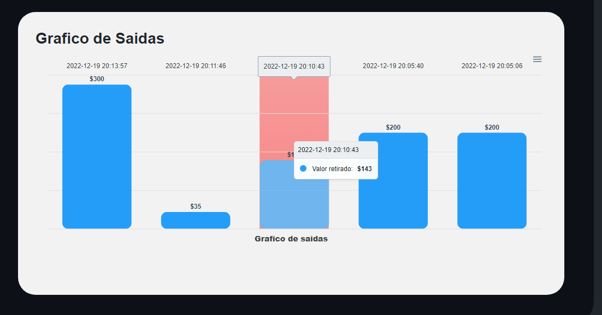

# my-wallet

## Login

Demo

 
email: adyjaelneto66@gmail.com

 senha: Zarkff1619

## Dashboard

A Dashboard é onde vocè pode adicionar tirar e tranferir seu dinheiro; 

Tambem é possivel ver um grafico para mostras as despesas e as receitas

  
  
  
 
 ## Entradas
 
 
Onde pode ver o seu histórico de entradas e o grafico

 
 
 
  ## Saidas
 
 
Onde pode ver o seu histórico de saidas e o grafico

 
 
 
 
   ## Tranferencias
 
 
Onde pode ver o seu histórico de Tranferencias e o grafico

 
 
 
